# Lazzat Ovqat — Loyihaning Arxitekturasi

## 📋 Umumiy Ko'rinish

**Lazzat Ovqat** — O'zbekistondagi restoran va kafelerini boshqarish uchun zamonaviy SaaS platforma.

---

## 🏗️ Arxitektura Diagrammasi

```mermaid
graph TB
    subgraph "Frontend Qatlami"
        WEB["🌐 Web Interfeysi<br/>Tailwind CSS + Alpine.js + HTMX"]
        MOBILE["📱 PWA<br/>Mobil Responsive"]
        OWNER["👨‍💼 Owner Dashboard<br/>Wagtail CMS + Admin"]
    end
    
    subgraph "API va Biznes Mantiqi"
        DJANGO["Django 5.1<br/>REST API + Views"]
        WAGTAIL["📝 Wagtail CMS<br/>No-code Sahifa Tahrirlash"]
        AUTH["🔐 Autentifikatsiya<br/>JWT + Sessions"]
    end
    
    subgraph "Dasturlar"
        ACCOUNTS["👤 Accounts<br/>Foydalanuvchilar, Egalari"]
        RESTAURANTS["🏪 Restaurants<br/>Profillar, Sozlamalar"]
        MENU["🍽️ Menu Boshqaruvi<br/>Kategoriyalar, Taomlar"]
        ORDERS["📦 Buyurtmalar<br/>To'lov, Kuzatish"]
        RESERVATIONS["📅 Bronirashlar<br/>Stol Bronirashi"]
        CORE["⚙️ Core<br/>Vositalar, Asoslar"]
    end
    
    subgraph "Tashqi Integratsiyalar"
        TELEGRAM["🤖 Telegram Bot<br/>Buyurtmalar, Bildirishnomalar"]
        PAYMENT["💳 To'lov Tizimi<br/>Click, PayMe, Stripe"]
        EMAIL["📧 Email Xizmati<br/>Bildirishnomalar"]
        SMS["💬 SMS Xizmati<br/>OTP, Ogohlantirishlar"]
    end
    
    subgraph "Ma'lumotlar Qatlami"
        POSTGRES["🗄️ PostgreSQL<br/>Asosiy Ma'lumotlar Bazasi"]
        REDIS["⚡ Redis<br/>Cache va Navbat"]
        STORAGE["☁️ Cloud Storage<br/>Rasmlar, Fayllar"]
    end
    
    subgraph "DevOps va Deployment"
        DOCKER["🐳 Docker & Compose<br/>Konteynerizatsiya"]
        NGINX["⚙️ Nginx<br/>Reverse Proxy"]
        CELERY["📊 Celery<br/>Asinxron Vazifalar"]
    end
    
    subgraph "Xalqaroshtirilish"
        I18N["🌍 i18n Tizimi<br/>O'zbek, Rus, Ingliz"]
    end
    
    WEB --> AUTH
    MOBILE --> AUTH
    OWNER --> WAGTAIL
    OWNER --> AUTH
    
    AUTH --> DJANGO
    WAGTAIL --> POSTGRES
    DJANGO --> ACCOUNTS
    DJANGO --> RESTAURANTS
    DJANGO --> MENU
    DJANGO --> ORDERS
    DJANGO --> RESERVATIONS
    DJANGO --> CORE
    DJANGO --> REDIS
    
    ACCOUNTS --> POSTGRES
    RESTAURANTS --> POSTGRES
    MENU --> POSTGRES
    ORDERS --> POSTGRES
    RESERVATIONS --> POSTGRES
    
    DJANGO --> TELEGRAM
    DJANGO --> PAYMENT
    DJANGO --> EMAIL
    DJANGO --> SMS
    
    DJANGO --> CELERY
    CELERY --> REDIS
    
    DJANGO --> I18N
    WEB --> I18N
    
    DJANGO --> STORAGE
    DOCKER --> NGINX
    DOCKER --> DJANGO
    DOCKER --> POSTGRES
    DOCKER --> REDIS
```

---

## 🔧 Texnologiya Staketi

| Komponent | Texnologiya |
|-----------|----------|
| **Backend** | Django 5.1, Python 3.11+ |
| **Ma'lumotlar Bazasi** | PostgreSQL 15+ |
| **Cache** | Redis |
| **Frontend** | Tailwind CSS, Alpine.js, HTMX |
| **CMS** | Wagtail |
| **Bot** | python-telegram-bot |
| **API** | Django REST Framework |
| **Asinxron** | Celery + Redis |
| **Autentifikatsiya** | JWT, Django-allauth |
| **Konteynerizatsiya** | Docker, Docker Compose |
| **Tillar** | O'zbek, Ruscha, Inglizcha |
